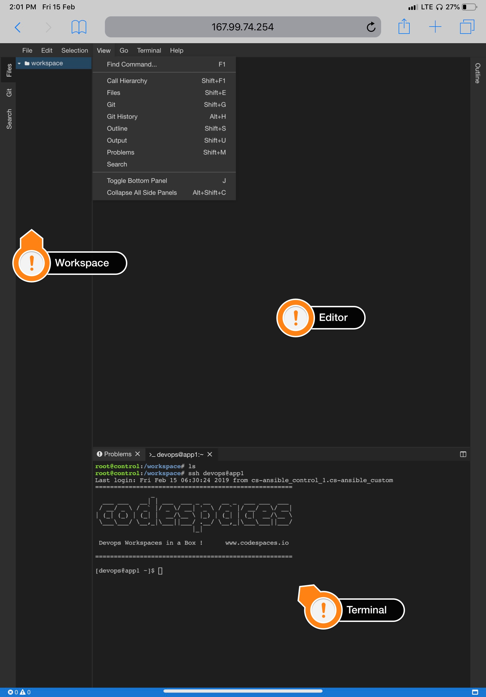
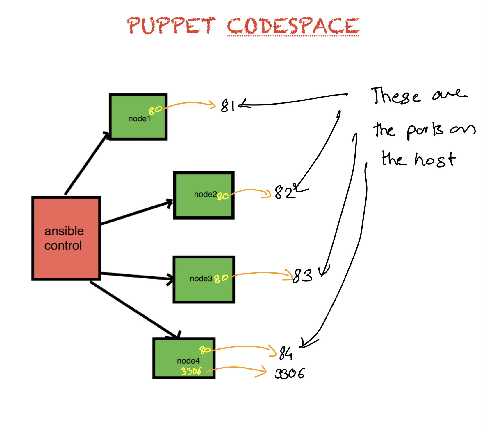

# Setting up  Codespaces IDE for puppet

After installing Docker-Engine and Docker-Compose, change directory into the corresponding tool you want to setup the environment for.
```
cd cs-puppet
```

Then all you need to do is to run

```
docker-compose up -d
```

This single command will initialize your Codespaces IDE.

## Use Codespaces IDE

To use Codespaces IDE,

  * Open your browser.
  * Visit your machine's IP with port 8000. (Ex. http://192.168.0.60:8000  or http://localhost:8000)


  * Now you will be presented with the Codespaces IDE console.




## Nodes Available





| Containers    | Purpose     | OS | Port Exposed | Host Port Mapped |
| :------------- | :------------- | :------------- | :------------- | :------------- |
| puppet       | puppet      | Ubuntu 18.04  | 8000,80 |  8000,80 |
| node1       | Load Balancer       | Centos 6.8  | 80 |  81 |
| node2       | App Server       | Centos 6.8 | 80 | 82 |
| node3       |  App Server      | Centos 6.8 | 80 | 83  |
| node4       |  Database      | Centos 6.8  | 3306,80  | 3306,84 |


## Managing Environment

Once created, you may want to stop the codespaces environment, or at times might have to recreate it completely, or reset a certain node. This section describes how to do so.

### Stopping codespaces environment

If you would like to stop the environment created earlier, its as simple as the follows,

`run the following from your codespaces directory`

```
cd cs-puppet

docker-compose stop
```

The above command will shut down the containers/bring those to stopped state.  You could easily start it all again, by running the following command from the same directory.

```
cd cs-puppet

docker-compose up -d
```


### Resetting the nodes/environment

Since this is a docker based environment, its easy to rest a node, or even the complete environment.  

To reset a node,

 * Find out the name of the node from **docker-compose.yml**


e.g

```
services:
  puppet:
    image: codespaces/puppet-master:2.0.0
    ports:
      - "8000:8000"
      - "80:80"
    environment:
      JAVA_ARGS: "-Xms256m -Xmx256m -XX:MaxPermSize=256m"
    volumes:
      - workspace:/workspace
    networks:
      - puppet
    container_name: puppet
    domainname: codespaces.io
    hostname: puppet
    restart: always

  node1:
    image: codespaces/puppet-node-centos-6:v0.1.3
    ports:
       - "81:80"
    networks:
      - puppet
    container_name: node1
    domainname: codespaces.io
    hostname: node1
    restart: always
```

In the above snippet of node, there are two nodes viz **puppet** and **node1**

You could alternately use the following command to find the node name

```
docker-compose ps
```

  * Once you decide which node you are resetting, run the following command to redo it. I am taking an example of a node by name **node1**

e.g.  
```
docker-compose stop node1
docker-compose rm node1
docker-compose up -d node1
```

Replace the name of actual node with lb.  That should help you redo the node


To reset the complete environment,

```
docker-compose down
docker-compose up -d  

```

The above command will recreate the nodes, without deleting your workspaces. Any files that you had created would still be available after you re launch the environment.
